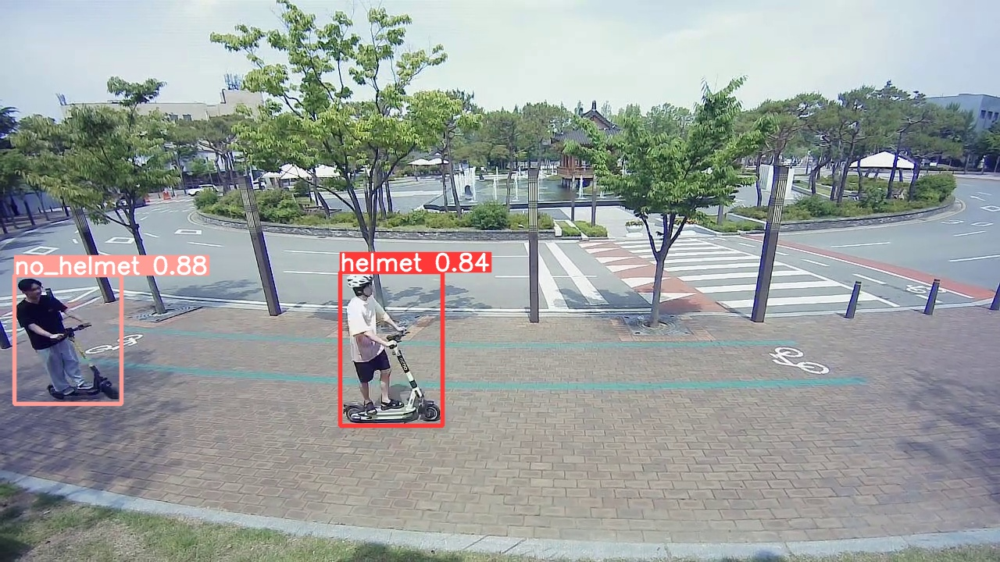
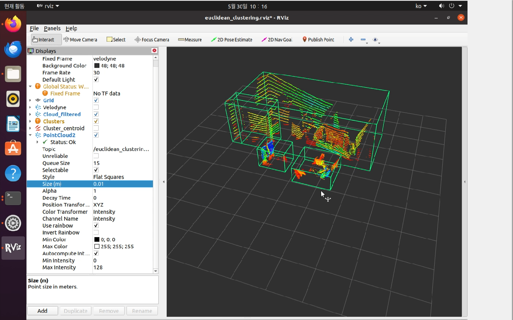

# Kickboard helmet detection
# 개요
- 전북대학교 산학실전캡스톤2
- 과제 : 카메라 및 라이다 센서 기반의 객체인식 모니터링 기술

## 소개
YOLOv5와 DeepSORT를 사용한 헬멧 감지 및 추적 시스템의 코드가 포함되어 있다.
시스템은 헬멧을 착용한 사람과 착용하지 않은 사람의 수를 계산할 수 있다.
VLP16 Velodyne Lidar를 Euclidean_clustering 알고리즘을 이용하여 3D point cloud 데이터를 확인할 수 있다.

## 기능
- **실시간 감지**: YOLOv5 모델을 사용하여 실시간으로 헬멧과 비헬멧 착용자를 감지
- **객체 추적**: 프레임 간 개인을 추적하기 위해 DeepSORT 알고리즘을 구현
- **object count**: 사전에 정의된 선을 교차하는 객체를 카운트하여 helmet, no_helmet 객체 갯수파악
- **비디오 저장 및 frame test**: 코드 실행 비디오가 저장되고, 'frame_split.py' 코드를 통해 비디오를 frame으로 쪼개서 정확도 test 가능
- **로그 파일**: 계수 결과를 요약한 로그 파일을 출력
- **실시간 3D데이터 확인**: ubuntu 환경에서 Ros Driver를 이용해 Velodyne Lidar를 Euclidean_clustering 알고리즘을 이용해서 시각화

## 필수 구성 요소
- Python 3.8 이상
- OpenCV
- PyTorch
- NumPy
- [deep_sort_realtime](https://github.com/levan92/deep_sort_realtime) 패키지

## 설치
1. YOLOv5 저장소를 클론한다:
```
git clone <https://github.com/ultralytics/yolov5.git>
```

2. 필요한 파이썬 패키지를 설치한다:
```
pip install -r requirements.txt
```

## 학습
train 폴더의 YOLOv5 폴더를 이용하여 학습시킬 수 있다.

YOLOv5m 가중치를 train/yolov5 폴더에 넣고 

```
python train.py --img 640 --batch 16 --epochs 50 --data (데이터 위치) --weights yolov5m.pt
```
명령어를 입력하면 학습이 가능하다.


## 사용 방법
시스템을 실행하려면 `kickboard.py` 스크립트를 실행:
python3 kickboard.py

이렇게 하면 코드에 지정된 비디오가 처리됨 출력 비디오는 `object_counting_output.avi`로 저장되며, count 결과는 `object_count_log.txt`에 기록된다.
카메라를 연결해서 실시간 테스트하고 싶으면 path 경로를 0으로 설정한다.

위에서 실행한 영상을 frame으로 쪼개서 정확도를 테스트한다:
python frame_split.py

## 설정
코드에서 다양한 설정을 조정할 수 있다, 예를 들어:
- 입력 비디오 경로
- YOLOv5 모델 가중치
- DeepSORT의 파라미터
- 교차 검출을 위한 선 위치

kickboard helemet detection을 이용한 결과 사진
  

# Lidar
VM VirtualBox의 ubuntu 환경에서 Lidar 구동, 구동을 위한 다음 단계:
- ubuntu와 Lidar의 네트워크 설정정
- ROS dependencies 설치 (20.04버전 -> noetic ROS 사용)
- VLP16 Driver 설치 <https://github.com/ros-drivers/velodyne.git> 파일 이용
- Euclidean_clustering 파일을 catkin_ws 의 src 파일내에 저장
- Rviz를 이용한 데이터 시각화

Euclidean_clustering 알고리즘을 이용한 Velodyne Lidar 구동 사진

해당 클러스터링은 [lidar clustering bench](https://github.com/cavayangtao/lidar_clustering_bench?tab=readme-ov-file)의 도움을 받았다.

